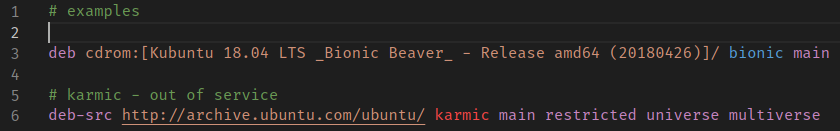

# apt-source-list-syntax README

## Features

Syntax highlighting for `apt`'s source.lists.
It is aware of basic keywords like `deb`, `deb-src`, `main`, `universe`, etc., and also have knows about most available architectures (got this list through `dpkg-architecture -L`).

No autocompletion yet. Sorry.

I picked common styles for keywords in order to get colorful view in any theme.

Reference:
https://manpages.debian.org/buster/apt/sources.list.5.en.html
